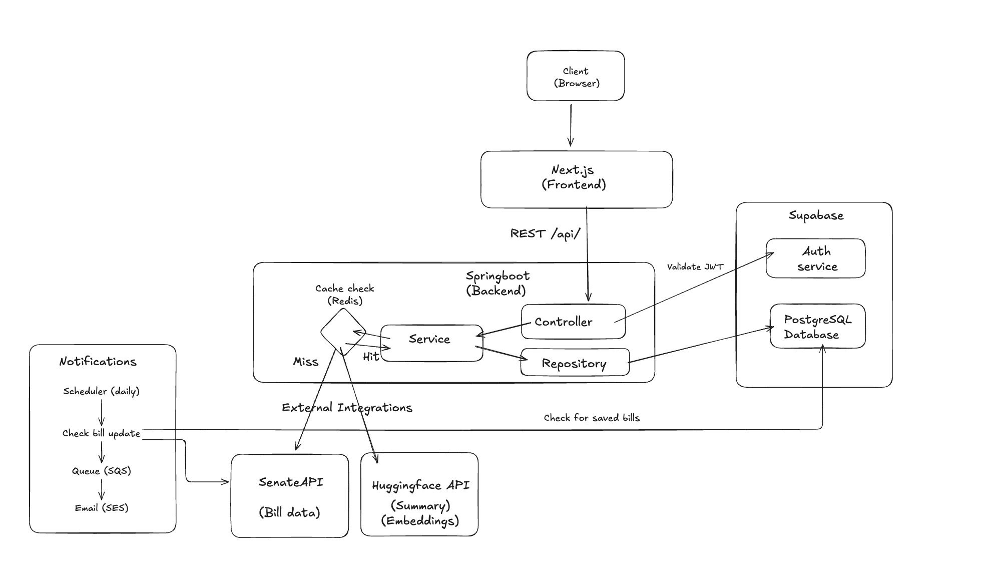

<div align="center">

# LegisTrack

**Track NY State legislation with AI-powered summaries**


</div>

---

Search NY Senate bills, get AI-generated summaries of complex legislation, and track bills over time.

## Features

- Keyword search (with chamber/status/committee filters) and semantic search over bill text
- Bill detail: sponsors, co-sponsors, committee, votes, full history, AI summaries, full-text PDF
- Track bills with notes and labels; get notified when a tracked bill's status changes
- Sign in required for tracking, labels, and AI summaries

## Tech Stack

**Frontend:** Next.js, React, TypeScript, Tailwind CSS

**Backend:** Spring Boot (Java 17), PostgreSQL + pgvector, Redis

**Services:** Supabase (auth + database), Hugging Face (embeddings + summaries), NY Senate API, AWS SQS

## Architecture



NY Senate API is the source of truth, Redis is the hot cache, Postgres is the durable store plus
pgvector index for semantic search. A daily scheduler diffs saved bills for status changes and
publishes to SQS and SES consumes it.

## How to Run

### Docker (recommended)

```bash
cp .env.example .env  
docker compose up --build
```

Frontend: `http://localhost:3000` · Backend: `http://localhost:8080`

### Local Development

**1. Backend**

```bash
cd backend
./run.sh
```

**2. Frontend**

```bash
cd frontend
npm install
npm run dev
```

## Environment Variables

Create `.env` in the root (see `.env.example`):

```env
DATABASE_URL=jdbc:postgresql://...
DATABASE_USERNAME=postgres
DATABASE_PASSWORD=...
SUPABASE_URL=https://xxx.supabase.co
SUPABASE_JWT_SECRET=
NEXT_PUBLIC_SUPABASE_URL=https://xxx.supabase.co
NEXT_PUBLIC_SUPABASE_ANON_KEY=...
NY_SENATE_API_KEY=...
HUGGINGFACE_API_KEY=...
REDIS_URL=redis://localhost:6379
AWS_REGION=us-east-1
AWS_ACCESS_KEY_ID=...
AWS_SECRET_ACCESS_KEY=...
SQS_QUEUE_URL=https://sqs.us-east-1.amazonaws.com/...
```

Auth requires either rotating your Supabase project's signing key to an asymmetric key (dashboard → JWT Keys → Rotate), or setting `SUPABASE_JWT_SECRET` above.
